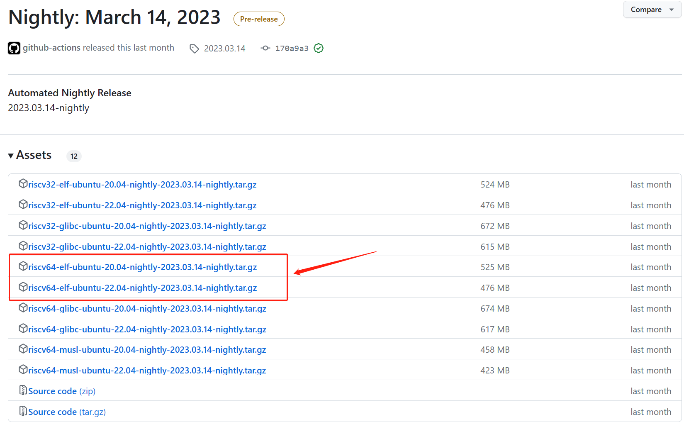

# rvemu
基于`risc-v`架构的高性能模拟器

> 课程文档地址：[手搓 RISC-V 高性能模拟器 (ksco.cc)](https://ksco.cc/rvemu/)
>
> 课程视频地址：[手搓 RISC-V 高性能模拟器（2023 年春季）](https://space.bilibili.com/296494084/channel/collectiondetail?sid=1245472)

## 环境搭建 ubuntu20.04

- [RISC-V GNU Compiler Toolchain](https://github.com/riscv-collab/riscv-gnu-toolchain)

  1.选择对应系统版本的编译工具链进行下载

  

  2.解压下载的压缩包

  ```shell
  tar -zxvf riscv64-elf-ubuntu-20.04-nightly-2023.03.14-nightly.tar.gz
  # 解压后生成的文件为`riscv`
  ```

  3.添加环境变量

  ```shell
  #只修改当前用户的环境变量
  `vim ~/.bashrc`
  #在文件的最后一行添加以下代码
  export PATH=$PATH:/home/timer/riscv/bin
  ```

- `clang`

  ```shell
  sudo apt install clang
  clang -v #查询版本，默认版本为 10.0.0
  ```

  

