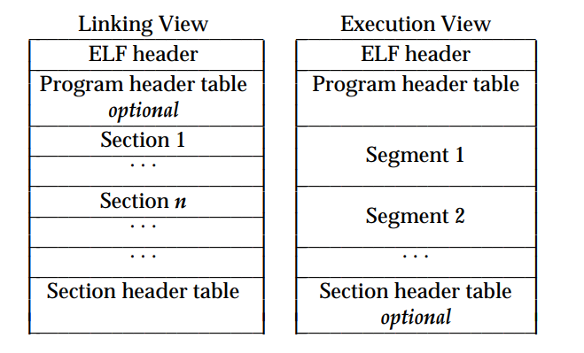
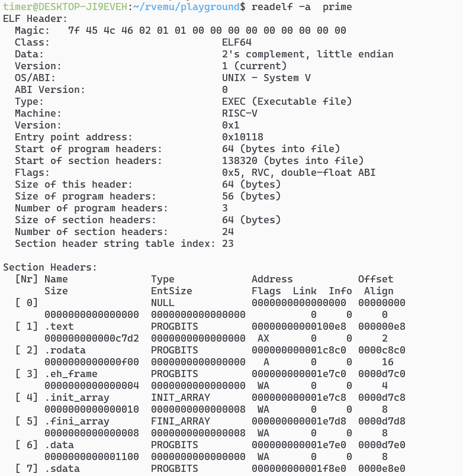
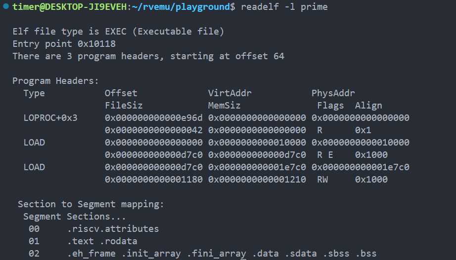

# rvemu
基于`risc-v`架构的高性能模拟器

> 课程文档地址：[手搓 RISC-V 高性能模拟器 (ksco.cc)](https://ksco.cc/rvemu/)
>
> 课程视频地址：[手搓 RISC-V 高性能模拟器（2023 年春季）](https://space.bilibili.com/296494084/channel/collectiondetail?sid=1245472)

## 环境搭建 

 - 本机环境：`wsl2 ubuntu20.04`

- [RISC-V GNU Compiler Toolchain](https://github.com/riscv-collab/riscv-gnu-toolchain)

  1.选择对应系统版本的编译工具链进行下载

  

  2.解压下载的压缩包

  ```shell
  tar -zxvf riscv64-elf-ubuntu-20.04-nightly-2023.03.14-nightly.tar.gz
  # 解压后生成的文件为`riscv`
  ```

  3.添加环境变量

  ```shell
  #只修改当前用户的环境变量
  `vim ~/.bashrc`
  #在文件的最后一行添加以下代码
  export PATH=$PATH:/home/timer/riscv/bin
  ```

- `clang`

  ```shell
  sudo apt install clang
  clang -v #查询版本，默认版本为 10.0.0
  ```

## 调试bug

- 在 `wsl2 vscode gdb` 调试时读取`elf`文件失败，`fd=-1`暂不知道原因,在终端直接`gdb rvemu`没问题

## 代码调试记录


### 原码、补码、反码

> [原码、反码、补码 - 知乎 (zhihu.com)](https://zhuanlan.zhihu.com/p/118432554)

```c
#define ROUNDDOWN(x, k) ((x) & -(k))
```

上面这个宏的作用是将给定的 x 向下舍入到 k 的倍数。

负数在计算机中是以**补码**的形式储存的，例如当`k=4096`时，二进制表示为`0001 0000 0000 0000`，补码的计算方式为`~x + 1`，因此 `-4096 = 0 1111 1111 1111 + 1 = 1 0000 0000 0000 0000`，然后再按位与运算，就可实现将给定的 x 向下舍入到 k 的倍数，其中 k 必须为 2 的倍数。

```c
#define ROUNDUP(x, k)   (((x) + (k)-1) & -(k))
```

这个宏定义了一个向上取整的操作，将 x 向上取到 k 的倍数

1. x + k - 1：将 x 加上 k 再减去 1，得到一个不小于 x 的最小的 k 的倍数；
2. -(k)：对 k 取负，再减去 1，得到一个低 k 位全是 1 的数；
3. &：对前两步的结果进行按位与操作，得到一个大于等于 x 的最小的 k 的倍数。

### 内存映射

> [一文读懂 mmap 原理 - 知乎 (zhihu.com)](https://zhuanlan.zhihu.com/p/366964820)

`mmap()`（Memory Map）函数是 Linux 中用于内存映射的系统调用，它的作用是将一个文件或者其它对象映射到进程的地址空间。通过 `mmap()` 函数映射文件，可以方便地在进程中访问文件的内容，而无需使用标准 I/O 函数库。

`mmap()` 函数通常与 `munmap()` 函数一起使用。`munmap()` 函数用于撤销内存映射，释放由 `mmap()` 函数创建的映射空间。

使用 `mmap()` 函数可以实现以下操作：

1. 将文件的内容映射到内存中，从而加速读取和写入文件的操作。
2. 在内存中创建匿名映射区域，用于进程间通信（IPC）或进程内临时数据存储。
3. 创建共享内存区域，用于多个进程共享数据。
4. 创建执行内存区域，将二进制可执行文件直接映射到进程的地址空间，从而实现更快速的代码加载和执行。

使用 `mmap()` 函数时需要指定映射的起始地址、映射的长度、权限、映射方式等参数，映射成功后会返回映射区域的起始地址。映射区域的起始地址需要满足特定的对齐要求，通常是内存页的大小。

```c
void *mmap(void *addr, size_t length, int prot, int flags, int fd, off_t offset);
```

其中各参数的含义如下：

- `addr`：映射的起始地址，如果为NULL，则由系统自动分配一个地址。
- `length`：映射的长度，以字节为单位。
- `prot`：映射区域的保护方式。可以为下列几种方式的组合：
  - `PROT_EXEC`：可执行。
  - `PROT_READ`：可读。
  - `PROT_WRITE`：可写。
  - `PROT_NONE`：不可访问。
- `flags`：标志位，可以是下列标志的组合：
  - `MAP_FIXED`：使用指定的映射起始地址，如果起始地址不可用，则会报错。
  - `MAP_SHARED`：共享映射，允许多个进程访问同一个内存区域，对共享内存区的修改会立即反映到所有的映射中。
  - `MAP_PRIVATE`：私有映射，内存区域只能被当前进程访问，对私有内存区的修改不会反映到其他进程中。
  - `MAP_ANONYMOUS`：创建一个匿名映射，不需要和文件关联。
- `fd`：映射对象的文件描述符，如果使用`MAP_ANONYMOUS`标志，则该参数应该设置为-1。
- `offset`：被映射对象的偏移量。如果映射的是文件，那么`offset`应该为`fd`指定的文件中的偏移量；如果是匿名映射，那么`offset`应该为0

函数的返回值是映射区的起始地址，如果映射失败则返回`MAP_FAILED`。


源代码在进行内存大小映射时，做了下面这样一个操作：

```c
// 对齐地址到一页内存的边界
u64 aligned_vaddr = ROUNDDOWN(vaddr, page_size);
//该段映射的内存大小为
u64 filesz = phdr->p_filesz + (vaddr - aligned_vaddr);
u64 memsz = phdr->p_memsz + (vaddr - aligned_vaddr);

```

额外加上了一个偏移地址，作者说是为了后面使用`mmap`函数让长度进行页对齐，这里不需要再加上一个偏移大小，将这个偏移地址删除后进行测试，暂未发现问题。==实际上在调用`mmap`函数时，如果给定的内存映射长度不是按照页对齐时，映射的内存大小会自动按照页对齐。==


## ELF文件解析

- 官方wiki：[可执行和可链接格式 - 维基百科 (wikipedia.org)](https://en.wikipedia.org/wiki/Executable_and_Linkable_Format)
- 官方PDF：[ELF_Format.pdf (skyfree.org)](http://www.skyfree.org/linux/references/ELF_Format.pdf)
- 使用手册：[ELF Header - Linker and Libraries Guide (oracle.com)](https://docs.oracle.com/cd/E23824_01/html/819-0690/chapter6-43405.html#scrolltoc)
- 参考博客：[ELF 文件解析 1-前述+文件头分析 - 知乎 (zhihu.com)](https://zhuanlan.zhihu.com/p/380908650)

### ELF文件结构概述

ELF（Executable and Linkable Format）是一种可执行文件和可链接库的标准格式，通常在Linux和其他类Unix操作系统中使用。ELF文件包含了程序的代码、数据、符号表、调试信息等。

ELF文件包含三个主要部分：头部、节区和程序头表。头部描述了ELF文件的基本信息，包括文件类型、机器类型、入口地址、节区表偏移等。节区包含了程序的代码、数据、符号表等信息。程序头表则描述了如何将ELF文件加载到内存中，包括需要加载的节区、地址、内存对齐方式等信息

ELF文件有两种用途，一种用于**程序链接**，一种用于**程序执行**，下图为官方文档中ELF文件两种组件视图



对于可执行程序，`Program Header`是必须的，描述了不同的段即`Segment`,`Section Header`是可选的 

对于链接程序，`Program Header`是可选的，`Section Header`是必须的，描述了不同的`section`

- 编译生成一个`risc-v64`的`elf`可执行文件

  ```shell
  cd playground
  riscv64-unknown-elf-gcc prime.c -o prime
  ```

- 查看生成的`elf`文件

  ```
  readelf -a prime
  ```

  

### 数据定义

`elf`文件支持具有8位、32位架构和64位架构的各种处理器。下表列出了32位数据类型和64位数据类型。

`elf`文件使用机器无关格式表示一些控制数据。该格式提供了对目标文件的通用识别和解释。`elf`文件中的其余数据使用目标处理器的编码，而不管创建文件的机器是什么

- 32位数据格式定义

| Name            | Size | Alignment | Purpose                  |
| :-------------- | :--- | :-------- | :----------------------- |
| `Elf32_Addr`    | `4`  | `4`       | Unsigned program address |
| `Elf32_Half`    | `2`  | `2`       | Unsigned medium integer  |
| `Elf32_Off`     | `4`  | `4`       | Unsigned file offset     |
| `Elf32_Sword`   | `4`  | `4`       | Signed integer           |
| `Elf32_Word`    | `4`  | `4`       | Unsigned integer         |
| `unsigned char` | `1`  | `1`       | Unsigned small integer   |

- 64位数据数据格式定义

| Name            | Size | Alignment | Purpose                  |
| :-------------- | :--- | :-------- | :----------------------- |
| `Elf64_Addr`    | `8`  | `8`       | Unsigned program address |
| `Elf64_Half`    | `2`  | `2`       | Unsigned medium integer  |
| `Elf64_Off`     | `8`  | `8`       | Unsigned file offset     |
| `Elf64_Sword`   | `4`  | `4`       | Signed integer           |
| `Elf64_Word`    | `4`  | `4`       | Unsigned integer         |
| `Elf64_Xword`   | `8`  | `8`       | Unsigned long integer    |
| `Elf64_Sxword`  | `8`  | `8`       | Signed long integer      |
| `unsigned char` | `1`  | `1`       | Unsigned small integer   |

`elf`文件格式定义的所有数据结构都遵循相关类别的自然大小和对齐准则。数据结构可以包含显式填充以确保4字节对齐，强制结构大小为4的倍数等等。数据也具有从文件开头开始的适当对齐方式。因此，例如，包含Elf32_Addr成员的结构在文件中是以4字节边界对齐的。类似地，包含Elf64_Addr成员的结构在8字节边界上对齐。


### ELF 文件的文件头（ELF Header）

ELF头文件描述了

```c
#define EI_NIDENT (16)
typedef struct {
        unsigned char   e_ident[EI_NIDENT]; 
        Elf32_Half      e_type;
        Elf32_Half      e_machine;
        Elf32_Word      e_version;
        Elf32_Addr      e_entry;
        Elf32_Off       e_phoff;
        Elf32_Off       e_shoff;
        Elf32_Word      e_flags;
        Elf32_Half      e_ehsize;
        Elf32_Half      e_phentsize;
        Elf32_Half      e_phnum;
        Elf32_Half      e_shentsize;
        Elf32_Half      e_shnum;
        Elf32_Half      e_shstrndx;
} Elf32_Ehdr;

typedef struct
{
  unsigned char	e_ident[EI_NIDENT]; /* Magic number and other info */   // 1 byte * 16
  Elf64_Half	e_type;		    /* Object file type */                  // 2 bytes
  Elf64_Half	e_machine;	    /* Architecture */						// 2 bytes
  Elf64_Word	e_version;	    /* Object file version */               // 4 bytes
  Elf64_Addr	e_entry;	    /* Entry point virtual address */       // 8 bytes
  Elf64_Off		e_phoff;	    /* Program header table file offset */  // 8 bytes
  Elf64_Off		e_shoff;	    /* Section header table file offset */  // 8 bytes   
  Elf64_Word	e_flags;	    /* Processor-specific flags */ 			// 4 bytes		   
  Elf64_Half	e_ehsize;	    /* ELF header size in bytes */			// 2 bytes
  Elf64_Half	e_phentsize;	/* Program header table entry size */	// 2 bytes
  Elf64_Half	e_phnum;	    /* Program header table entry count */	// 2 bytes
  Elf64_Half	e_shentsize;	/* Section header table entry size */	// 2 bytes
  Elf64_Half	e_shnum;	    /* Section header table entry count */	// 2 bytes
  Elf64_Half	e_shstrndx;	    /* Section header string table index */	// 2 bytes
} Elf64_Ehdr;
//64位的大小为64字节
```


- **e_ident**

  最开始处的这 16 个字节含有 ELF 文件的识别标志，作为一个数组，它的各个索引位置的字节数据有固定的含义，提供一些用于解码和解析文件内容的数据，是不依赖于具体操作系统的。

  | 数据成员名称  | 数组下标的索引 | 占用字节数 | 意义                                                       |
  | ------------- | -------------- | ---------- | ---------------------------------------------------------- |
  | EI_MAG0       | 0              | 1          | 文件标识-魔数：0x7F                                        |
  | EI_MAG1       | 1              | 1          | 文件标识：45                                               |
  | EI_MAG2       | 2              | 1          | 文件标识：43                                               |
  | EI_MAG3       | 3              | 1          | 文件标识：46                                               |
  | EI_CLASS      | 4              | 1          | 文件类别：表示为32位还是64位                               |
  | EI_DATA       | 5              | 1          | 编码格式：设置大端还是小端                                 |
  | EI_VERSION    | 6              | 1          | 文件版本：默认为1                                          |
  | EI_OSABI      | 7              | 1          | OS ABI 识别标志                                            |
  | EI_ABIVERSION | 8              | 1          | ABI 版本                                                   |
  | EI_PAD        | 9              | 7          | 补充字节开始的地址，目前未使用。应该用零填充，读取时忽略。 |

	- **EI_MAG0** ~ **EI_MAG3**（**E**LF **I**dentification-**Mag**ic Number）：文件的最前面 4 字节 e_ident[EI_MAG0] ~ e_ident[EI_MAG3] 的内容被称为“魔数”，用于标识这是一个 ELF 文件。这 4 个字节存放的 16 进制数值是固定的，依次为`0x7f`，`0x45`，`0x4c`和`0x46`，后三个数值对应的 ASCII码 为 “E”，“L” 和 “F”。
	
	- **EI_CLASS**（**E**LF **I**dentification-**Class**）：e_ident[EI_CLASS] 指明文件位数的标志，根据当前字节位置上的数值说明该文件是 32 位的还是 64 位的 ELF 文件。下面为可能的几个取值及其对应的含义。值为 1：32 位目标文件；值为 2：64 位目标文件。下方为源码中的定义、可取值及其对应的含义。
	
	  ```c
	  #define EI_CLASS	4		/* File class byte index */
	  #define ELFCLASSNONE	0		/* Invalid class */
	  #define ELFCLASS32	1		/* 32-bit objects */
	  #define ELFCLASS64	2		/* 64-bit objects */
	  #define ELFCLASSNUM	3
	  ```
	
	- **EI_DATA**（**E**LF **I**dentification-**Data**）：e_ident[EI_DATA] 指明了目标文件中的数据编码格式，指明是小端编码还是大端编码。值为 1：补码编码（2's complement）且为小端编码（little endian）；值为 2：补码编码且为大端编码（big endian）。下方为源码中的定义、可取值及其对应的含义。
	
- **e_type**

  标识目标文件类型，如下表所示，

  | Name        | Value    | Meaning            |
  | :---------- | :------- | :----------------- |
  | `ET_NONE`   | `0x00`   | No file type       |
  | `ET_REL`    | `0x01`   | Relocatable file   |
  | `ET_EXEC`   | `0x02`   | Executable file    |
  | `ET_DYN`    | `0x03`   | Shared object file |
  | `ET_CORE`   | `0x04`   | Core file          |
  | `ET_LOPROC` | `0xff00` | Processor-specific |
  | `ET_HIPROC` | `0xffff` | Processor-specific |

- **e_machine**

  指定单个文件所需的体系结构。相关架构如下表所示，列出了一些常用的架构,可在官方`wiki`上查表找到所有支持的架构

  | Name             | Value  | Meaning       |
  | :--------------- | :----- | :------------ |
  | `EM_NONE`        | `0`    | No machine    |
  | `EM_SPARC`       | `2`    | SPARC         |
  | `EM_386`         | `3`    | Intel 80386   |
  | `EM_SPARC32PLUS` | `18`   | Sun SPARC 32+ |
  | `EM_SPARCV9`     | `43`   | SPARC V9      |
  | `EM_AMD64`       | `62`   | AMD 64        |
  | `EM_RISCV`       | `0xF3` | RISC-V        |

- **e_version**

  标识目标文件的版本，初始版本的ELF设置为1

- **e_entry**

  这是进程开始执行的入口点的内存地址。该字段长度为32位或64位，取决于前面定义的格式。如果文件没有关联的入口点，则该值为零。

- **e_phoff**

  `Program Header`的文件起始地址偏移量，以字节为单位。如果文件没有程序头表，则该成员为零。

- **e_shoff**

  指明节头表（section header table）开始处在文件中的偏移量

- **e_flags**

  处理器特定的标志，一般为0。

- **e_ehsize**

  ELF头的大小(以字节为单位)。

- **e_phentsize**

  `Program Header`中每个表项的大小，以字节为单位

- **e_phnum**

  `Program Header`中总共有多少个表项，如果一个目标文件中没有程序头表，该值应设为 0

- **e_shentsize**

  一个段头表条目的大小。

- **e_shnum**

  包含段头表中条目的数量。

- **e_shstrndx**

  包含一个索引，指向段头表中包含段名称的段头条目。

### Program Header

> 参考文档：[Program Header - Linker and Libraries Guide (oracle.com)](https://docs.oracle.com/cd/E23824_01/html/819-0690/chapter6-83432.html#scrolltoc)

程序头表告诉系统如何创建进程映像。它位于文件偏移量`e_phoff`处，由`e_phnum`项组成，每个项的大小`e_phentsize`。32位ELF与64位ELF的布局略有不同，因为出于对齐原因，`p_flags`位于不同的结构位置。

可用如下的命令来查看一个 ELF 文件的 `Program Header`

```shell
readelf -l prime
```



可以看到该ELF文件的`Program Header`有三个表项

- `Program Header`的定义如下

```c
typedef struct {
        Elf32_Word      p_type;
        Elf32_Off       p_offset;
        Elf32_Addr      p_vaddr;
        Elf32_Addr      p_paddr;
        Elf32_Word      p_filesz;
        Elf32_Word      p_memsz;
        Elf32_Word      p_flags;
        Elf32_Word      p_align;
} Elf32_Phdr;

typedef struct {
        Elf64_Word      p_type;
        Elf64_Word      p_flags;
        Elf64_Off       p_offset;
        Elf64_Addr      p_vaddr;
        Elf64_Addr      p_paddr;
        Elf64_Xword     p_filesz;
        Elf64_Xword     p_memsz;
        Elf64_Xword     p_align;
} Elf64_Phdr;
```


- `p_type`

  定义了段的类型

  | Name               | Value        | Meaning                              |
  | :----------------- | :----------- | ------------------------------------ |
  | `PT_NULL`          | `0`          | 程序头表项未使用。                   |
  | `PT_LOAD`          | `1`          | 此类型表明本程序头指向一个可装载的段 |
  | `PT_DYNAMIC`       | `2`          | 表明本段指明了动态连接的信息。       |
  | `PT_INTERP`        | `3`          |                                      |
  | `PT_NOTE`          | `4`          |                                      |
  | `PT_SHLIB`         | `5`          |                                      |
  | `PT_PHDR`          | `6`          |                                      |
  | `PT_TLS`           | `7`          |                                      |
  | `PT_LOOS`          | `0x60000000` |                                      |
  | `PT_SUNW_UNWIND`   | `0x6464e550` |                                      |
  | `PT_SUNW_EH_FRAME` | `0x6474e550` |                                      |
  | `PT_LOSUNW`        | `0x6ffffffa` |                                      |
  | `PT_SUNWBSS`       | `0x6ffffffa` |                                      |
  | `PT_SUNWSTACK`     | `0x6ffffffb` |                                      |
  | `PT_SUNWDTRACE`    | `0x6ffffffc` |                                      |
  | `PT_SUNWCAP`       | `0x6ffffffd` |                                      |
  | `PT_HISUNW`        | `0x6fffffff` |                                      |
  | `PT_HIOS`          | `0x6fffffff` |                                      |
  | `PT_LOPROC`        | `0x70000000` |                                      |
  | `PT_HIPROC`        | `0x7fffffff` |                                      |

- `p_offset`（**P**rogram Header-File **Offset**）：此字段（8 字节）给出本段内容在文件中的位置，即段内容的开始位置相对于文件开头的偏移量。
- `p_vaddr`（**P**rogram Header-**V**irtual **Addr**ess）：此字段（8 字节）给出本段内容的开始位置在进程空间中的虚拟地址。
- `p_paddr`（**P**rogram Header-**P**hysical **Addr**ess）：此字段（8 字节）给出本段内容的开始位置在进程空间中的物理地址。对于目前大多数现代操作系统而言，应用程序中段的物理地址事先是不可知的，所以目前这个 成员多数情况下保留不用，或者被操作系统改作它用。

- `p_filesz`（**P**rogram Header-**File** **S**i**z**e）：此字段（8 字节）给出本段内容在文件中的大小，单位是字节，可以是 0。
- `p_memsz`（**P**rogram Header-**Mem**ory **S**i**z**e）：此字段（8 字节）给出本段内容在内容镜像中的大小，单位是字节，可以是 0。
- `p_align`（**P**rogram Header-**Align**ment ）：此字段（8 字节）指明本段内容如何在内存和文件中对齐。如果该值为 0 或 1，表明没有对齐要求；否则，p_align 应该是一个正整数，并且是 2 的幂次数。p_vaddr 和 p_offset 在对 p_align 取模后应该相等。注：对于可装载的段来说，其 p_vaddr 和 p_offset 的值至少要向内存页面大小对齐。

- `p_flags`（**P**rogram Header-**Flags**）：此字段（4 字节）给出本段内容的属性，指明了段的权限。虽然 ELF 文件格式中没有规定，但是一个可执行程序至少会有一个可加载的段。当为可加载段创建内存镜像时，系统会按照 p_flags 的指示给段赋予一定的权限。

  | Name          | Value        | Meaning     |
  | :------------ | :----------- | :---------- |
  | `PF_X`        | `0x1`        | Execute     |
  | `PF_W`        | `0x2`        | Write       |
  | `PF_R`        | `0x4`        | Read        |
  | `PF_MASKPROC` | `0xf0000000` | Unspecified |

  

  
